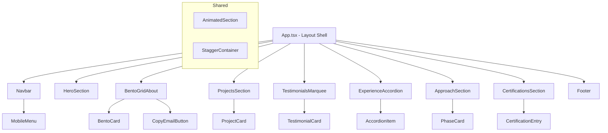

# Design Document: Portfolio Redesign

## Overview

This design transforms the existing monolithic `App.tsx` portfolio into a component-based architecture using React 19, Tailwind CSS 4, Motion (Framer Motion), and Lucide React. The redesign introduces a Bento Grid layout, testimonials marquee, work experience accordion, approach section, certifications display, and enhanced footer with copy-to-clipboard functionality — all built on a dark theme with responsive breakpoints and accessibility support.

The architecture prioritizes:
- **Separation of concerns** via dedicated component files
- **Reusability** through shared UI primitives (Section wrapper, animated containers)
- **Performance** via font-display swap, image fallbacks, and Motion's viewport-triggered animations with `once: true`
- **Accessibility** via `prefers-reduced-motion` support, WCAG AA contrast, keyboard navigation, and appropriate ARIA attributes

## Architecture

### High-Level Component Tree



### Directory Structure

```
src/
├── App.tsx                    # Root layout, section ordering
├── main.tsx                   # React DOM entry
├── index.css                  # Tailwind imports, theme, base styles
├── components/
│   ├── Navbar.tsx             # Fixed nav + mobile hamburger overlay
│   ├── HeroSection.tsx        # Animated hero with image, name, tagline
│   ├── BentoGridAbout.tsx     # Bento grid layout with cards
│   ├── BentoCard.tsx          # Individual bento card wrapper
│   ├── ProjectsSection.tsx    # Projects grid
│   ├── ProjectCard.tsx        # Individual project card
│   ├── TestimonialsMarquee.tsx# CSS-animated infinite scroll
│   ├── TestimonialCard.tsx    # Single testimonial quote
│   ├── ExperienceAccordion.tsx# Accordion container
│   ├── AccordionItem.tsx      # Expandable accordion row
│   ├── ApproachSection.tsx    # 3-phase numbered cards
│   ├── CertificationsSection.tsx # Certification entries grid
│   ├── Footer.tsx             # CTA heading, copy email, socials
│   ├── CopyEmailButton.tsx    # Clipboard copy with feedback
│   └── ui/
│       ├── AnimatedSection.tsx # Motion wrapper with viewport trigger
│       └── StaggerContainer.tsx# Staggered children animations
├── data/
│   ├── projects.ts            # Project data array
│   ├── testimonials.ts        # Testimonials array
│   ├── experience.ts          # Work experience entries
│   ├── certifications.ts      # Certifications array
│   └── skills.ts              # Skills/tech stack data
├── hooks/
│   ├── useClipboard.ts        # Copy-to-clipboard hook
│   ├── useReducedMotion.ts    # prefers-reduced-motion detection
│   └── useActiveSection.ts    # Intersection observer for nav highlight
└── types/
    └── index.ts               # Shared TypeScript interfaces
```

### Animation Strategy

All animations use the Motion library (`motion/react`). The approach:

1. **Entrance animations**: Triggered via `whileInView` with `viewport={{ once: true }}`. Content transitions from `opacity: 0, y: 20` to `opacity: 1, y: 0` over 400–600ms.
2. **Staggered children**: Parent uses `staggerChildren: 0.1` in variants to delay each child's entrance by 100ms.
3. **Hover animations**: `whileHover` for scale (1.02–1.05) or border-color transitions on cards.
4. **Reduced motion**: A `useReducedMotion` hook reads `prefers-reduced-motion`. When active, all Motion components render in their final state (no transition, `initial={false}`).

### Responsive Breakpoints

Using Tailwind's mobile-first approach:
- **Default (< 768px)**: Single-column layouts, stacked elements, 44px min touch targets
- **`md` (≥ 768px)**: 2-column grids, side-by-side layouts, desktop nav links
- **`lg` (≥ 1024px)**: 3-column project grid, full bento grid spans
- **`xl` (≥ 1440px)**: Max-width container constraints

## Components and Interfaces

### Navbar

| Prop | Type | Description |
|------|------|-------------|
| sections | `NavLink[]` | Array of section names and href anchors |

**Behavior:**
- Fixed position with `z-50`
- Transparent background → glass backdrop-blur after 50px scroll
- Desktop: horizontal link list. Mobile: hamburger → full-screen overlay
- Active section highlighting via `useActiveSection` hook (IntersectionObserver)
- Smooth-scroll on link click via `element.scrollIntoView({ behavior: 'smooth' })`

### HeroSection

| Prop | Type | Description |
|------|------|-------------|
| — | — | Self-contained, uses static data |

**Behavior:**
- Profile image with `` + `onError` fallback to a CSS gradient placeholder
- Name: fade-in + slide-up (delay 0ms)
- Title: typewriter effect using Motion's `animate` on a text clip
- Tagline: fade-in (delay 400ms)
- CTA button: smooth-scrolls to `#projects`
- Bouncing chevron indicator at bottom

### BentoGridAbout

**Grid Configuration (desktop):**
```
| col-span-2, row-span-2 | col-span-1 | col-span-1 |
| col-span-1             | col-span-2 | col-span-1 |
```

Cards:
1. Bio + profile image (large, spans 2 cols)
2. Collaboration approach
3. Timezone flexibility
4. Tech stack icons (spans 2 cols)
5. Quality passion statement
6. Contact CTA with `CopyEmailButton`

### ProjectCard

| Prop | Type | Description |
|------|------|-------------|
| project | `Project` | Project data object |
| index | `number` | For stagger delay calculation |

**Behavior:**
- Hover: translateY(-4px) + border color highlight
- Entrance: fade-up via AnimatedSection
- Conditional "Check Live Site" button based on `project.link` existence
- Tags rendered as pill badges

### TestimonialsMarquee

**Implementation:** Pure CSS animation (not Motion) for performance:
- Duplicate the testimonial list to create seamless loop
- CSS `@keyframes marquee { from { transform: translateX(0) } to { transform: translateX(-50%) } }`
- `animation-play-state: paused` on container `:hover`
- Each card has min-width 280px on mobile

### ExperienceAccordion

| Prop | Type | Description |
|------|------|-------------|
| items | `ExperienceEntry[]` | Work history array |

**State:** `expandedId: string | null` — only one item open at a time.

**AccordionItem Behavior:**
- Click/Enter/Space toggles expansion
- Height animated via Motion's `animate={{ height: 'auto' }}` with layout animation
- Chevron icon rotates 180° when expanded
- `role="button"`, `aria-expanded`, `aria-controls` for accessibility

### CopyEmailButton

| Prop | Type | Description |
|------|------|-------------|
| email | `string` | Email address to copy |

**State Machine:**
- `idle` → shows email text
- `copied` → shows "Copied!" for 2s → returns to `idle`
- `error` → shows error indicator for 2s → returns to `idle`

Uses `navigator.clipboard.writeText()` with try/catch fallback.

### ApproachSection

Displays 3 `PhaseCard` components with staggered entrance (100–200ms delay between cards). Each card shows a number badge, title, and description paragraph.

### CertificationsSection

Grid layout (1 col mobile, 2–3 cols desktop). Each entry shows certification name, organization, and date. Fade-up entrance animation on viewport entry.

### Shared UI Components

**AnimatedSection**: Wraps any content with Motion `whileInView` entrance animation. Props: `delay`, `direction` (up/left/right), `className`. Respects reduced motion.

**StaggerContainer**: Motion component with `staggerChildren` variant. Wraps grids/lists for cascading entrance effects.

## Data Models

### TypeScript Interfaces

```typescript
// types/index.ts

export interface NavLink {
  name: string;
  href: string;
}

export interface Project {
  title: string;         // max 60 chars
  description: string;   // max 150 chars
  tags: string[];        // 1-5 items
  link?: string;         // optional external URL
  image: string;         // image URL or local path
}

export interface Testimonial {
  name: string;
  title: string;         // job title
  quote: string;
}

export interface ExperienceEntry {
  id: string;
  company: string;
  jobTitle: string;
  dateRange: string;     // e.g. "Jan 2022 – Present"
  responsibilities: string[];
}

export interface Certification {
  name: string;          // max 100 chars
  organization: string;
  dateObtained: string;  // "Month Year" format
}

export interface PhaseInfo {
  number: number;
  title: string;
  description: string;   // max 200 chars
}

export interface SkillCategory {
  category: string;
  items: string[];
  icon: string;          // Lucide icon name
}
```

### Static Data Files

Data is extracted from the current `App.tsx` constants and supplemented with new content:

- `data/projects.ts` — 7 projects (from existing `PROJECTS` array)
- `data/testimonials.ts` — 8 testimonials (new content)
- `data/experience.ts` — Work history entries (new content)
- `data/certifications.ts` — Certification entries (new content)
- `data/skills.ts` — Tech stack categories (from existing `SKILLS` array, extended)


## Correctness Properties

*A property is a characteristic or behavior that should hold true across all valid executions of a system — essentially, a formal statement about what the system should do. Properties serve as the bridge between human-readable specifications and machine-verifiable correctness guarantees.*

### Property 1: Data field character limits

*For any* data entity in the application (Project, PhaseInfo), the text fields must respect their defined maximum character limits: project titles ≤ 60 characters, project descriptions ≤ 150 characters, and phase descriptions ≤ 200 characters.

**Validates: Requirements 4.2, 7.5**

### Property 2: External links have security attributes

*For any* anchor element that opens an external URL (project links, social links), the element must have `target="_blank"` and `rel="noopener noreferrer"` attributes set.

**Validates: Requirements 4.3, 8.6**

### Property 3: Conditional button rendering based on link presence

*For any* Project object where the `link` field is undefined or empty, the rendered ProjectCard must not contain a "Check Live Site" button. Conversely, for any Project with a defined `link`, the button must be present.

**Validates: Requirements 4.7**

### Property 4: Testimonial card displays all required fields

*For any* Testimonial object with non-empty name, title, and quote fields, the rendered TestimonialCard must contain text matching each of those three fields.

**Validates: Requirements 5.2**

### Property 5: Time-ordered lists maintain reverse chronological order

*For any* array of date-ordered entries (ExperienceEntry or Certification), the rendered list must display items in reverse chronological order, where each entry's date is equal to or more recent than the entry below it.

**Validates: Requirements 6.1, 11.1**

### Property 6: Accordion single-expansion invariant

*For any* sequence of click/toggle actions on the ExperienceAccordion, the number of simultaneously expanded items must never exceed 1. After any toggle action, either zero or one item is in the expanded state.

**Validates: Requirements 6.6**

### Property 7: Accordion keyboard-click equivalence

*For any* accordion item in any state (expanded or collapsed), activating it via keyboard (Enter or Space key) must produce the same resulting state as activating it via mouse click.

**Validates: Requirements 6.9**

### Property 8: Collapsed accordion item displays required fields

*For any* ExperienceEntry, when its corresponding AccordionItem is in the collapsed state, the rendered output must contain the company name, job title, and date range text.

**Validates: Requirements 6.2**

### Property 9: Copy-to-clipboard state machine transitions

*For any* invocation of the clipboard copy function: if the clipboard write succeeds, the hook state must transition to "copied"; if it fails, the state must transition to "error". In both cases, the state must revert to "idle" after 2000 milliseconds (±100ms tolerance).

**Validates: Requirements 8.3, 8.4, 8.5**

### Property 10: Animation positional offset within bounds

*For any* AnimatedSection component in the application, the initial positional offset (translateY or translateX) must be no greater than 30 pixels, and the transition duration must be between 200ms and 800ms.

**Validates: Requirements 9.1, 9.4**

### Property 11: Reduced motion suppresses all animations

*For any* animated component in the application, when the `prefers-reduced-motion: reduce` media query is active (useReducedMotion returns true), the component must render in its final visible state without any opacity or transform transitions.

**Validates: Requirements 9.6**

### Property 12: Certification entry displays required information

*For any* Certification object, the rendered certification entry must display the certification name, issuing organization, and date in "Month Year" format.

**Validates: Requirements 11.2**

## Error Handling

### Image Loading Failures

- **HeroSection profile image**: `onError` handler swaps `` for a CSS gradient placeholder (`bg-gradient-to-br from-gray-700 to-gray-900`) with initials overlay
- **ProjectCard images**: `onError` replaces with a neutral gray placeholder with project title text

### Clipboard API Failures

- **CopyEmailButton**: `navigator.clipboard.writeText()` wrapped in try/catch
  - On `catch`: state transitions to `"error"`, displays error indicator (red tint + "Failed to copy" text)
  - Fallback: If `navigator.clipboard` is undefined (older browsers), fall back to `document.execCommand('copy')` with a hidden textarea
  - Auto-revert: Both success and error states revert to idle after 2000ms via `setTimeout`

### Font Loading Failures

- Google Fonts import uses `&display=swap` parameter
- CSS `@theme` defines system font fallback stack: `"Inter", ui-sans-serif, system-ui, sans-serif`
- Content renders immediately with fallback fonts; no FOIT (Flash of Invisible Text)

### IntersectionObserver Unavailability

- `useActiveSection` hook checks for `IntersectionObserver` support
- Graceful degradation: if unsupported, no active link highlighting (nav links remain static)

### Animation Errors

- Motion library errors are non-fatal — components render without animation
- `useReducedMotion` hook uses `window.matchMedia` with a fallback to `false` if API unavailable

## Testing Strategy

### Unit Tests (Example-Based)

Focus areas:
- **Component rendering**: Each component renders without errors with valid props
- **Static content**: Hero tagline, approach phases, nav links contain expected text
- **Responsive classes**: Correct Tailwind classes applied at breakpoints
- **Fallback behavior**: Image onError triggers placeholder, font-display swap
- **Initial state**: Accordion starts fully collapsed, marquee auto-plays

Tools: Vitest + React Testing Library

### Property-Based Tests

Library: **fast-check** (with Vitest as the test runner)

Each property test runs a minimum of 100 iterations with randomly generated inputs.

| Property | Generator Strategy |
|----------|-------------------|
| P1: Data limits | Generate strings of varying lengths, verify constraints |
| P2: External link attrs | Generate Project objects with/without links, render and check attrs |
| P3: Conditional button | Generate Projects with link=undefined vs link="https://...", verify render |
| P4: Testimonial fields | Generate Testimonial objects with arbitrary strings, verify render output |
| P5: Chronological order | Generate arrays of dates, sort, verify rendered order matches |
| P6: Accordion invariant | Generate sequences of toggle actions, verify state after each |
| P7: Keyboard equivalence | Generate accordion items, compare click vs keypress results |
| P8: Collapsed fields | Generate ExperienceEntry objects, verify collapsed render |
| P9: Clipboard state machine | Generate success/failure scenarios, verify state transitions |
| P10: Animation bounds | Generate AnimatedSection configs, verify offset ≤ 30 and duration in range |
| P11: Reduced motion | Generate animated components with reduced motion flag, verify no transitions |
| P12: Certification fields | Generate Certification objects, verify rendered content |

Configuration:
- Minimum 100 iterations per property test
- Tag format: `Feature: portfolio-redesign, Property {N}: {title}`

### Integration Tests

- **Smooth scrolling**: Verify nav link clicks trigger scroll to correct section
- **Responsive layout**: Playwright tests at 320px, 768px, 1024px, 1440px verifying no overflow
- **Accessibility audit**: axe-core automated checks for WCAG AA contrast, ARIA attributes

### Visual Regression Tests

- Playwright screenshot comparisons at each breakpoint
- Reduced motion mode verification

### Performance Tests

- Lighthouse CI with 4G throttling verifying LCP < 3s
- Font loading verification (no FOIT)

